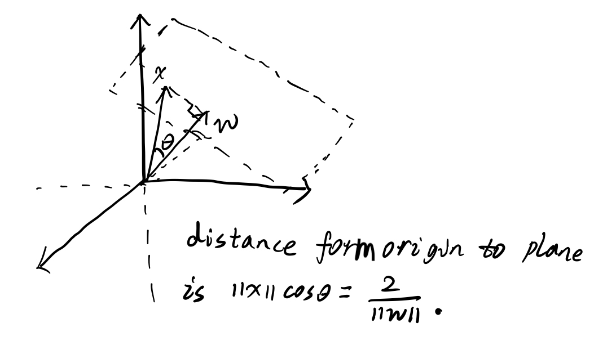
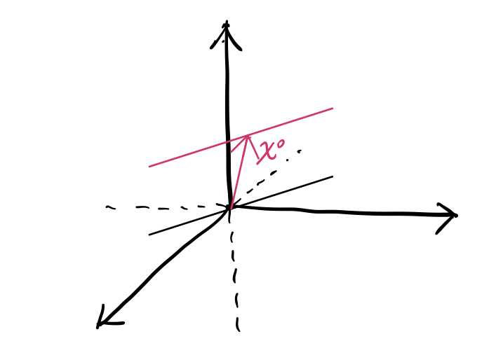

# Vectors

### 1.Why space can be represented as the span of a set of vectors?
An important result of linear algebra is that a subspace  $S$ can always be represented as the span of a set of vectors $x_i \in R^n, i=1,\dots,m$, that is, as a set of the form.
$$
S = span(x_1,\cdots,x_m):=\{\sum_{i=1}^m \lambda_ix_i:\lambda\in R^m\}.
$$

**Proof:** Get a nonzero vector from $S$ and get another nonzero vector, repeat the process until all other vectors can be represented by the vectors we already have. Assume these vectors are $x_i,i=1,\dots,m$, their span is $V$. For any vector in $S$, since the vector can be represented by $x_i$, this vector must be in $V$, so $S \subset V$. According to the definition  of space. Any linear combination of the vectors in $S$ still in it which means $V \subset S$. Thus $S = V$.

### 2.Dimension of an affine subspace.

$L$ in $R^3$ defined by the linear equations
$$
x_1 - 13x_2 + 4x_3 = 2,\quad 3x_2 - x_3 = 9
$$
is an affine subspace of dimension 1.
Let's set the constant terms in above equations to zero. We can solve for $x_3$ and get $x_1=x_2,x_3=3x_2$. We obtain a representation of the linear subspace as the set of vectors $x\in R^3$ that have the form
$$
x = \begin{pmatrix}
    1\\
    1\\
    3
\end{pmatrix}t,
$$
for some scalar $t = x_2$. Hence the linear subspace is the span of the vector $u:=(1,1,3)$, and is of dimension 1.

We obtain a representation of the original affine set by finding a particular solution $x^0$, by setting say $x_2 = 0$ and solving for $x_1,x_3$. We obtain
$$
x^0 = \begin{pmatrix}
    38\\
    0\\
    -9
\end{pmatrix}.
$$
The affine subspace $L$ is thus the line $x^0 + span(u),$ where $x^0,u$ are defined above.

How to prove the correctness of this solution?
There's something interesting I want to mention. For example, $x_1 - 13x_2 + 4x_3 = 2$ can be written as $$
\omega \cdot \begin{pmatrix}
    x_1\\
    x_2\\
    x_3
\end{pmatrix} = 2.
$$
where $\omega = \begin{pmatrix}
    1\\
    -13\\
    4
\end{pmatrix}$.
Write this equation in another form $$
||\omega||\cdot||x||\cos\theta = 2
$$

So this equation represents a plane. We have two equations and their intersection is a line(the exception is when the two planes are the same). 
To find how to represent this line using vectors. Find the passing origin parallel line which is equal to set the constant term to zero and then find vectors span this line and translate it by adding $x^0$.

The geometry view of this method is just move the black line along $x^0$.

### 3.C-S Inequality
[**proof1**](https://inst.eecs.berkeley.edu/~ee127/sp21/livebook/thm_cauchyschwartz.html)

**proof2:**
**put my own proof here.**

### 4.Projection on a line.

投影的定义，分析上的证明，求导式的证明，课本上的证明

### 5.Orthogonalization: the Gram-Schmidt procedure

简化一下textbook即可，这节的理论依据在4已经讲过了。

### Hyperplanes
讲一下a的意义，b的意义，x是一些什么样的点。从原点到plane的距离是多少，半平面的定义和定义的几何直观。